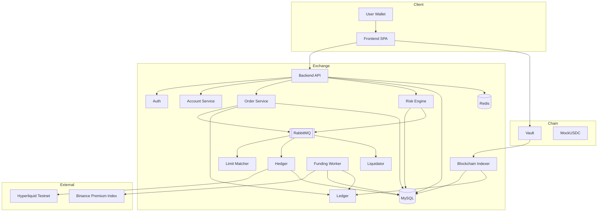
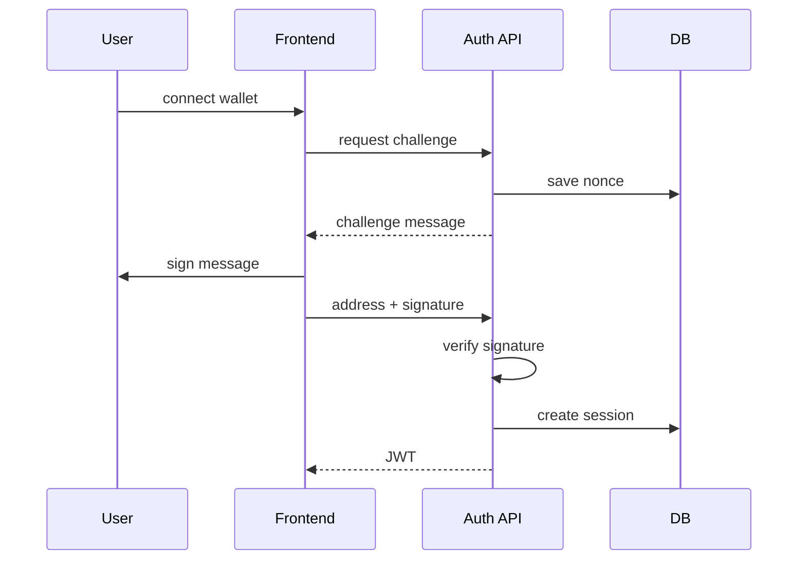
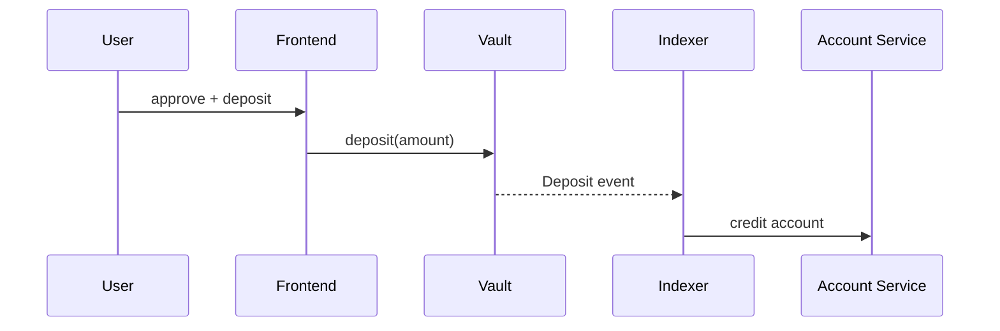
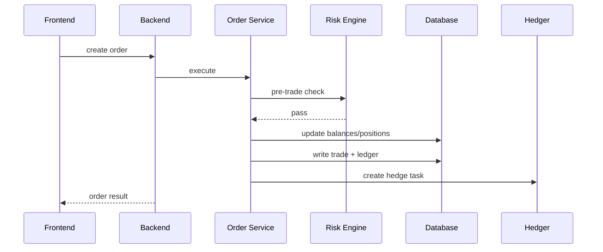
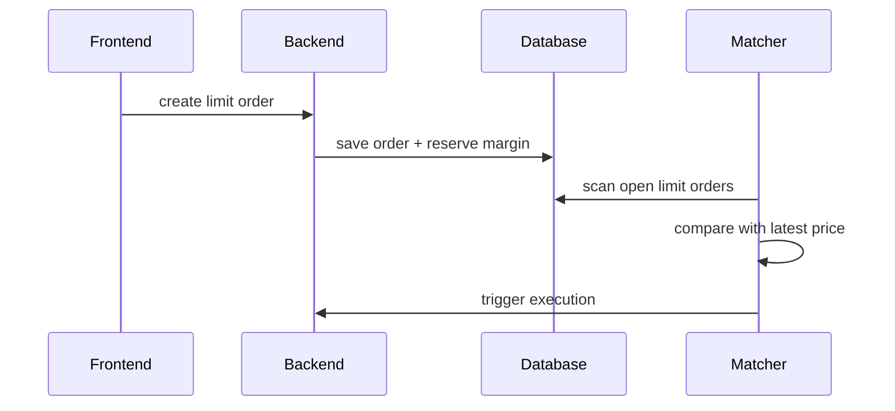
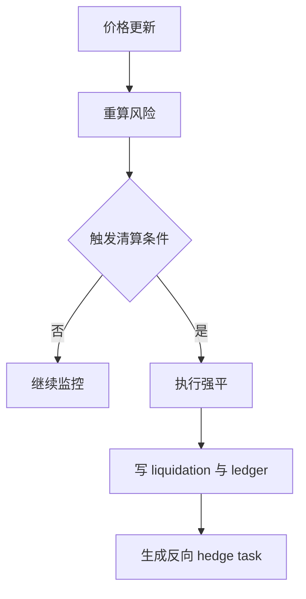

# Architecture Document

## 1. 系统概述

RGPerp 是一套链上资金托管、链下交易执行、链下风控与清算、外部净敞口对冲的永续合约交易系统。系统围绕以下原则构建：

- 用户资产由链上 Vault 合约托管
- 链下负责订单执行、仓位管理、PnL、风险状态、清算和资金费率结算
- 外部风险敞口通过 Hyperliquid Testnet 统一对冲
- 所有核心模块按多交易对设计，当前支持 `BTC/USDC`、`ETH/USDC`、`SOL/USDC`

## 2. 顶层架构

## 3. 模块划分

### 3.1 Frontend

前端提供以下能力：

- 钱包连接与签名登录
- 交易终端、图表与盘口展示
- 市价单 / 限价单下单
- 仓位、挂单、成交、订单历史
- 账户资产、充值、提现、资金费率记录
- 管理页：风险快照、对冲任务、清算记录、系统告警

### 3.2 Auth

- 生成 challenge message
- 校验 EIP-191 签名
- 签发 JWT
- 维护登录会话

### 3.3 Account Service

- 管理账户余额与锁仓
- 输出账户权益和风控视图
- 维护交易权益与兑付口径

### 3.4 Vault Contract

Vault 提供：

- `deposit(uint256 amount)`
- `withdraw(...)`
- operator 授权提现

链上事件：

- `Deposit`
- `Withdraw`

### 3.5 Blockchain Indexer

- 监听 Vault 事件
- 幂等写入 `vault_events`
- 更新链下账户与账本

### 3.6 Order Service / Trade Engine

交易引擎负责：

- 参数校验
- 获取价格
- 交易前风控
- 保证金冻结与释放
- 仓位开仓 / 加仓 / 减仓 / 平仓
- 已实现盈亏、手续费与账本写入
- 生成对冲任务

### 3.7 Risk Engine

风险引擎负责：

- 初始保证金、维持保证金、账户权益、风险率计算
- `normal / at_risk / reduce_only / liquidating / frozen` 状态推进
- 提现前风险校验
- 兑付能力与提现上限计算

### 3.8 Limit Matcher

限价单采用条件触发模型：

- 用户提交挂单
- 后台 matcher 监听价格
- 到价后复用现有成交链路执行

### 3.9 Hedger

Hedger 根据系统内部净敞口执行外部对冲：

- 生成 hedge task / hedge order
- 自动重试 3 次
- 管理页支持手动重试
- 风险快照持续记录内部净仓、外部仓位和偏差

### 3.10 Liquidator

Liquidator 持续扫描风险仓位：

- 触发隔离仓位和全仓账户的强平
- 写入清算记录
- 生成反向对冲任务

### 3.11 Funding Worker

Funding Worker 负责：

- 读取 funding rate 和下次结算时间
- 对 open positions 执行资金费率结算
- 写 `funding_events` 和 `ledger_entries`
- 更新账户风险状态

### 3.12 Ledger

账本记录以下资金变化：

- 充值 / 提现
- 交易手续费
- 已实现盈亏
- 清算
- 资金费率

## 4. 核心数据流

### 4.1 登录

### 4.2 充值

### 4.3 下单

### 4.4 限价单

### 4.5 清算

## 5. 风控设计

### 5.1 账户与保证金模型

- `available_balance`
- `locked_balance`
- `equity = available_balance + locked_balance + unrealized_pnl`
- `maintenance_margin`
- `risk_ratio`

### 5.2 交易前风控

校验内容包括：

- 用户状态
- symbol 状态
- 杠杆和下单数量
- 保证金是否足够
- 风险状态是否允许开仓
- 价格源是否有效

### 5.3 持仓风控

- 全仓按账户级权益评估
- 逐仓按单仓权益评估
- 维持保证金占权益比用于风险展示与状态切换

### 5.4 提现风控

提现同时受以下限制：

- 风险状态
- 账户可用余额
- 可兑付额度 `payout_capacity`
- 链上 operator 授权

## 6. 清算设计

### 6.1 触发条件

- 全仓：账户权益低于维持保证金
- 逐仓：单仓权益低于维持保证金

### 6.2 执行结果

- 更新仓位状态
- 写清算记录
- 写成交与账本
- 生成对冲任务

## 7. 对冲设计

### 7.1 目标定义

对冲目标仅由系统内部净敞口决定：

- `target_hedge_position = internal_net_position`

### 7.2 任务执行

- 自动重试最多 3 次
- 失败后可在管理页手动重试
- 风险快照继续记录真实外部仓位，仅用于监控偏差

### 7.3 风险快照

风险快照逐交易对记录：

- 内部净仓
- 外部真实仓位
- 偏差
- 健康状态

## 8. 资金费率设计

### 8.1 数据来源

- `price_ticks.funding_rate`
- `price_ticks.funding_next_at`

### 8.2 结算规则

- 正 funding：多头支付，空头收取
- 负 funding：空头支付，多头收取

### 8.3 结算结果

- 更新账户余额
- 写 `funding_events`
- 写账本
- 重新同步风险状态

## 9. 关键设计决策

### 9.1 交易模型

系统采用 CFD 模式，不维护用户撮合订单簿。

### 9.2 链上 / 链下边界

链上负责资产托管与出入金可验证性；链下负责高频状态更新、风控、清算和对冲。

### 9.3 限价单模型

限价单采用条件触发执行模型，不引入完整撮合簿复杂度。

### 9.4 对冲模型

对冲任务只对齐系统内部净敞口，风险快照单独监控外部真实仓位。

### 9.5 资金模型

账户权益与兑付能力分离，盈利提现受平台真实可兑付余额约束。

## 10. 已知限制

- 外部对冲账户应作为系统专用账户使用
- 盘口深度为展示层，不参与真实撮合
- 条件单当前不包含 OCO、追踪止损等高级策略
