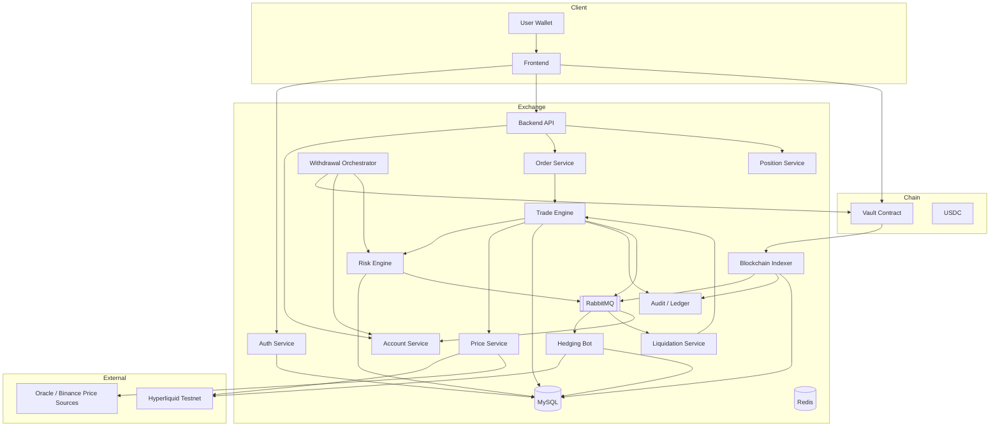
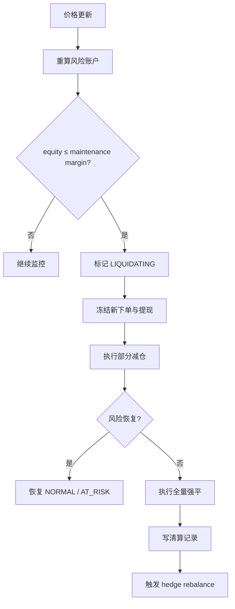
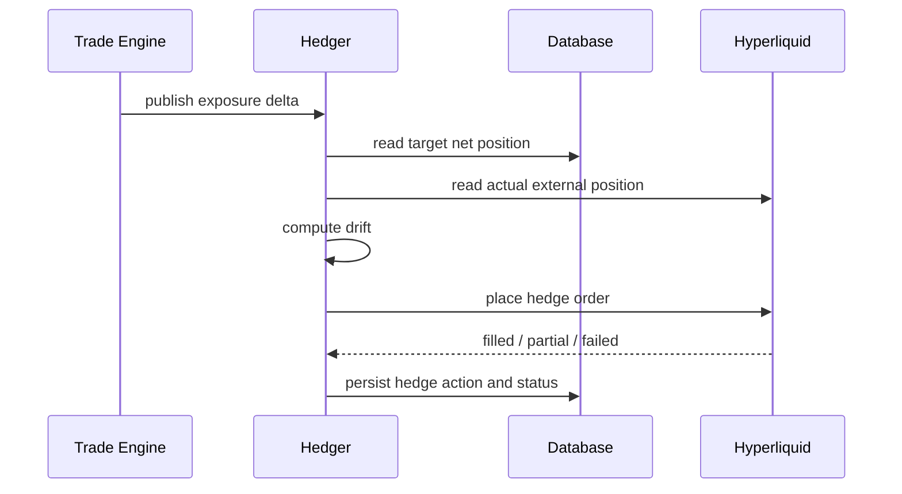
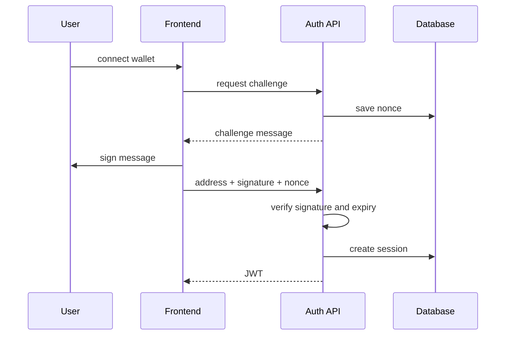
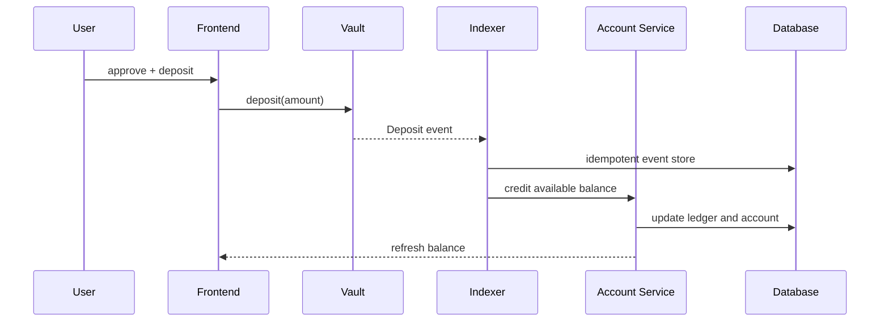
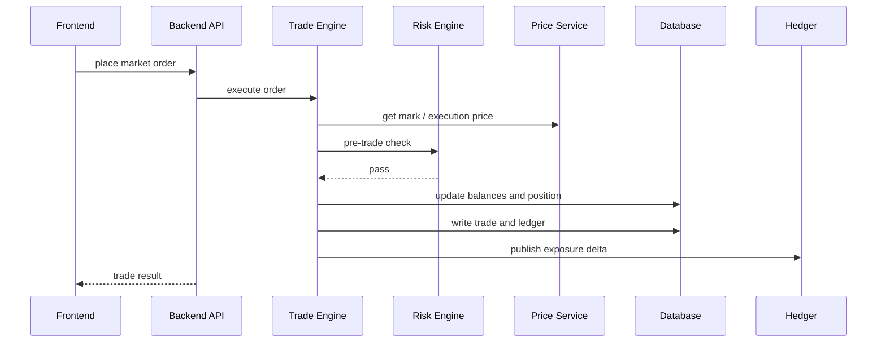
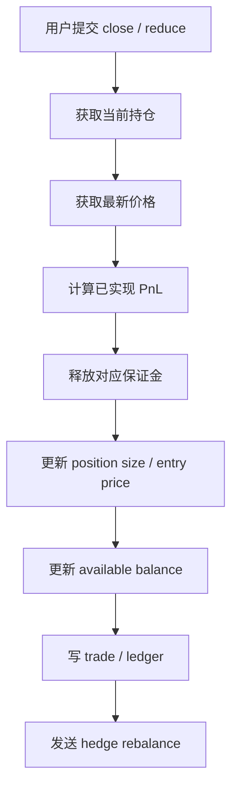
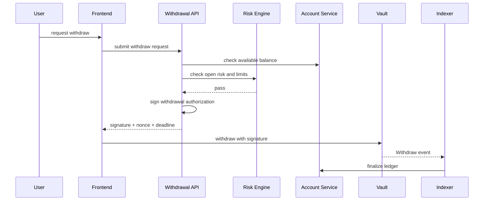

# Architecture Document

## 1. 系统概述

RGPerp 采用链上资金托管、链下账户与交易、外部流动性对冲的三层架构。

核心原则：

- 用户资产由链上 Vault 合约托管，出入金以链上事件为结算依据
- 交易执行、仓位管理、风控与清算在链下完成
- 平台净风险敞口通过对冲层统一处理，当前以 mock hedger 演示，后续切换 Hyperliquid Testnet
- 所有模块按多 symbol 设计，当前已支持 `BTC/USDC`、`ETH/USDC`、`SOL/USDC`

## 2. 顶层架构



## 3. 模块划分

### 3.1 Frontend

- 钱包连接与签名登录
- K 线与行情展示
- 下单面板（市价单、杠杆、逐仓 / 全仓、部分平仓）
- 余额、仓位、PnL、风险率展示
- 充值、提现、订单历史、对冲状态可视化

页面：登录页、交易页、资产页、历史页、管理监控页。

### 3.2 Auth Service

- 生成一次性 nonce / challenge
- 校验 EIP-191 签名
- 管理 JWT session
- challenge 包含 `nonce + domain + chainId + timestamp`，防重放

### 3.3 Account Service

- 管理 `available_balance`、`locked_balance`
- 汇总 realized / unrealized PnL，计算 equity
- 提供账户视图给前端

### 3.4 Vault Contract

接口：

- `deposit(uint256 amount)`
- `withdraw(address user, uint256 amount, uint256 nonce, uint256 deadline, bytes signature)`
- `setOperator(address operator, bool allowed)`

事件：

- `Deposit(address indexed user, uint256 amount)`
- `Withdraw(address indexed user, uint256 amount)`

提现由后端 operator 签名授权，合约校验签名与 nonce 后执行。

### 3.5 Blockchain Indexer

- 监听 Vault 的 Deposit / Withdraw 事件
- 以 `tx_hash + log_index` 做幂等去重
- 将链上事件映射为内部账本变更
- 处理链重组与重复消费

### 3.6 Order Service

- 接收订单请求，校验参数
- 将合法请求送入交易引擎

订单字段：`symbol`、`side`、`size`、`margin`、`leverage`、`client_order_id`、`reduce_only`。

### 3.7 Trade Engine

采用 CFD 模式，用户订单与平台资金池即时成交。

执行流程：

1. 获取最新 mark price
2. 调用 Risk Engine 做交易前风控
3. 扣减或释放保证金
4. 更新仓位（开仓 / 加仓 / 减仓 / 反手 / 平仓）
5. 计算手续费、均价、已实现盈亏
6. 写审计流水
7. 生成 hedge task，并由 Hedger 异步处理

### 3.8 Risk Engine

交易前校验：

- 用户状态、symbol 状态
- size ≥ 最小下单量
- leverage ≤ symbol 最大杠杆
- available balance 足够覆盖初始保证金
- 下单后仓位未超过用户上限
- 下单后交易所净敞口未超过全局上限
- 价格源在有效时间窗口内

持仓监控：

- 实时计算 equity、maintenance margin、margin ratio
- 对冲偏差、价格源健康度

风险状态分级：`NORMAL` → `AT_RISK` → `REDUCE_ONLY` → `LIQUIDATING` → `FROZEN`

### 3.9 Liquidation Service

- 持续扫描风险账户
- 当 equity ≤ maintenance margin 时触发清算
- 支持部分清算（分档 25% / 50% / 100%）
- 清算后自动触发 hedge rebalance
- 记录清算价格、手续费、剩余权益
- 坏账由保险基金吸收

清算流程：



### 3.10 Hedging Bot

按交易所净敞口统一对冲，而非逐笔订单对冲。

定义：

- `internal_net_position(symbol)` = 所有用户仓位求和
- `external_hedge_position(symbol)` = Hyperliquid 当前仓位
- `drift = internal_net_position - external_hedge_position`

目标：使 drift 趋近 0。

当前状态：

- 已实现 hedge task / hedge order 数据流
- 已实现 `mock` adapter 与独立 hedger 进程
- 已拆分 `hyperliquid` adapter 结构，真实签名与正式下单仍待接通

触发方式：交易后即时触发 + 周期定时校正。



策略参数：

- `hedge_threshold`：小于阈值不触发
- `cooldown_window`：短窗口内批量净额
- `max_single_hedge_notional`：单笔上限
- `circuit_breaker`：连续失败后切换全站 reduce-only

对冲异常处理：

- Hyperliquid API 不可用 → 重试 + 指数退避
- 部分成交 → 记录偏差，下一周期补齐
- 外部仓位被清算 / ADL → 报警 + 人工介入
- 连续失败超阈值 → 暂停新开仓，仅允许平仓

### 3.11 Price Service

- 主行情源：Hyperliquid `allMids` / `candleSnapshot`
- 兜底源：第三方 API
- 开发模式：mock + manual override

输出三层价格：

- `index_price`：外部参考价
- `mark_price`：风控与 PnL 计算
- `execution_price`：内部成交价

异常识别：价格跳变超阈值 → 暂停交易；价格陈旧超窗口 → 拒绝下单。

### 3.12 Audit / Ledger

- 记录所有余额变更的流水
- 记录订单、仓位、清算、对冲全生命周期
- 支持审计回放与问题追踪

## 4. 核心数据流

### 4.1 钱包登录



### 4.2 入金



### 4.3 开仓



### 4.4 平仓与减仓



### 4.5 提现



## 5. 风控设计

### 5.1 账户与保证金模型

每个用户账户包含：

- `available_balance`：可用于开仓或提现
- `locked_balance`：已占用初始保证金
- `equity = available_balance + locked_balance + unrealized_pnl`
- `maintenance_margin = abs(position_size) * mark_price * mmr`
- `margin_ratio = equity / maintenance_margin`

保证金公式：

- `notional = abs(position_size) * mark_price`
- `initial_margin = notional / leverage`
- `maintenance_margin = notional * maintenance_margin_rate`

### 5.2 交易前风控

校验项：

- 用户状态非 frozen / banned
- symbol 状态为 trading
- 价格源未过期
- available balance ≥ initial margin + fee
- leverage ≤ max leverage
- position notional ≤ max position notional
- 交易所净敞口未超过全局上限

### 5.3 持仓风控

持续监控：

- equity、maintenance margin、margin ratio
- symbol 波动率
- 对冲偏差
- 价格源健康度

### 5.4 对冲风控

监控指标：

- `internal_net_exposure`
- `external_hedge_position`
- `drift = internal - external`
- `hedge_latency`
- `hedge_reject_count`

处置策略：

- drift 小于阈值 → 允许延迟补单
- drift 超阈值 → 立即补单
- 连续失败 → 暂停新开仓，仅允许减仓 / 平仓

### 5.5 提现风控

校验项：

- available balance 足够
- 无 LIQUIDATING / FROZEN 状态
- 未超过单笔 / 单日限额
- 无未完成清算或未确认链上事件

## 6. 清算设计

### 6.1 触发条件

```
equity <= maintenance_margin
```

等价条件：`margin_ratio <= 1`

### 6.2 清算流程

1. 风控扫描器发现风险账户
2. 标记账户 `LIQUIDATING`，冻结新下单与提现
3. 读取最新 mark price
4. 执行部分清算（分档：25% → 50% → 100%）
5. 计算清算手续费，计入保险基金
6. 释放保证金，更新已实现盈亏
7. 生成反向对冲任务
8. 若权益仍为负，记录坏账由保险基金覆盖

### 6.3 价格区分

- `liquidation_price`：理论触发价
- `bankruptcy_price`：账户权益归零价
- `liquidation_execution_price`：实际清算成交价（含保护价差）

## 7. 设计决策

### 7.1 交易模型

采用 CFD（差价合约）模式。用户与平台资金池成交，平台作为对手方，通过外部对冲转移净风险。

CFD 模式使资金、仓位、PnL、清算与对冲形成自然闭环，且与 Market Order 高度匹配。

### 7.2 链上 vs 链下职责划分

链上负责资产托管与出入金可验证性；链下负责高频状态变更和风险计算。两者通过 Indexer 实现最终一致。

### 7.3 清算与对冲独立服务

清算和对冲均为持续运行的状态机，独立于同步 API 链路。独立部署便于重试、调度、监控、熔断和审计。

### 7.4 异步对冲

用户下单不等待对冲完成即返回结果。对冲异步执行，配合重试、告警和开仓熔断机制保障风险可控。

### 7.5 全仓保证金模型

首发采用全仓账户模型，账户级风控、清算和提现控制逻辑更简洁。逐仓模式作为后续扩展。

### 7.6 审计账本

所有余额变更均写入 ledger_entries，确保资金、订单、清算、对冲全流程可追溯。

## 8. 路线规划

### Phase 1：单 symbol 完整闭环

- 钱包登录、Vault 入金、后端授权提现
- BTC-PERP 市价开平仓
- 保证金与 PnL 系统
- 净敞口对冲
- 基础清算

### Phase 2：风控增强

- 分级风控状态
- 部分清算
- 对冲 reconcile 与重试策略
- 管理监控页

### Phase 3：多 symbol 扩展

- ETH-PERP 及更多标的
- symbol 配置中心
- 按品种风控参数

### Phase 4：高级功能

- 限价单、条件单
- 资金费率（Funding Rate）
- 保险基金
- 自动减仓（ADL）
