# RGPerp 永续合约系统演示文档

本文档按核心链路展开演示步骤，每步预留截图位置，便于配合操作截图形成完整演示材料。

---

## 一、演示概述

RGPerp 采用**链上托管 + 链下交易 + 外部对冲**的三层架构：

- **链上**：Vault 合约托管用户资产，出入金以链上事件为结算依据
- **链下**：交易执行、仓位管理、风控与清算在链下完成
- **对冲**：平台净敞口通过 Hyperliquid 等外部 venue 统一对冲

**核心演示链路**：环境准备 → 钱包登录 → 链上充值 → 开仓 → 持仓风控 → 平仓 → 提现（可选：清算流程）

---

## 二、环境准备

### 2.1 重置链与数据库

执行一键重置脚本，清空数据并重新部署合约：

```bash
cd /path/to/PerpExchange
bash .local/reset_demo_env.sh
```

脚本将完成：停止 Anvil、清空 Docker 卷、启动 MySQL/Redis/RabbitMQ、部署 Vault 与 MockUSDC、更新 `.env`、为演示账户充值。


### 2.2 启动服务

```bash
docker compose up -d
```

启动后包含：server、indexer、hedger、liquidator、matcher、fundingd、mysql、redis、rabbitmq。

健康检查：

```bash
curl -s http://127.0.0.1:18080/health | jq .
```


### 2.3 启动前端

```bash
cd frontend && pnpm install && pnpm dev
```

前端默认运行在 `http://localhost:3000`。

---

## 三、步骤一：登录首页

### 操作

1. 浏览器访问 `http://localhost:3000`
2. 查看 Landing Page：Magic Rings 背景、Blob Cursor、品牌 Logo 轮播
3. 点击 **Launch App** 进入应用

### 预期

- 首页展示品牌 slogan 与 Launch App 按钮
- 点击后跳转至 `/app` 交易页或登录流程

<!-- 图4：Landing Page 首页 -->


<!-- 图5：Launch App 按钮与跳转 -->
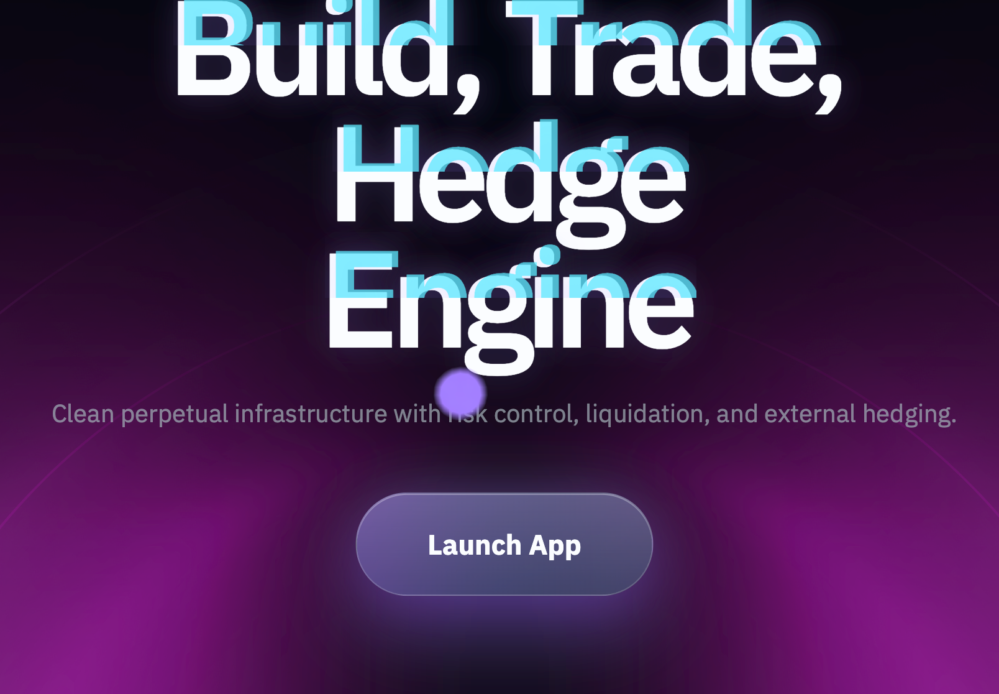

---

## 四、步骤二：钱包连接与登录

### 操作

1. 点击 **Connect Wallet** 连接 MetaMask 等钱包
2. 选择本地网络（如 Localhost 8545，Chain ID 31337）
3. 连接后，系统展示 EIP-191 签名挑战
4. 在钱包中签名 challenge message
5. 签名成功后获得 JWT，进入交易页

### 技术说明

- 后端 `/api/v1/auth/challenge` 返回 `nonce` 与 `message`
- 用户对 `message` 签名后调用 `/api/v1/auth/login`
- 后端校验签名，返回 JWT，用于后续 API 鉴权

### 预期

- 钱包连接成功
- 签名弹窗出现并完成签名
- 登录后进入交易页，顶部显示已连接地址

<!-- 图6：Connect Wallet 按钮 -->
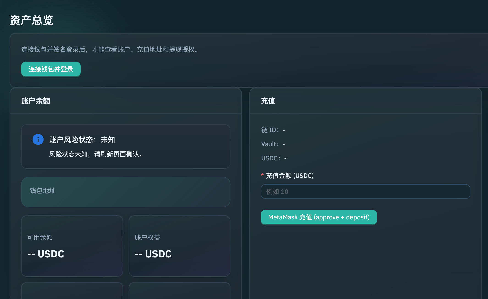

<!-- 图7：签名挑战与签名确认 -->
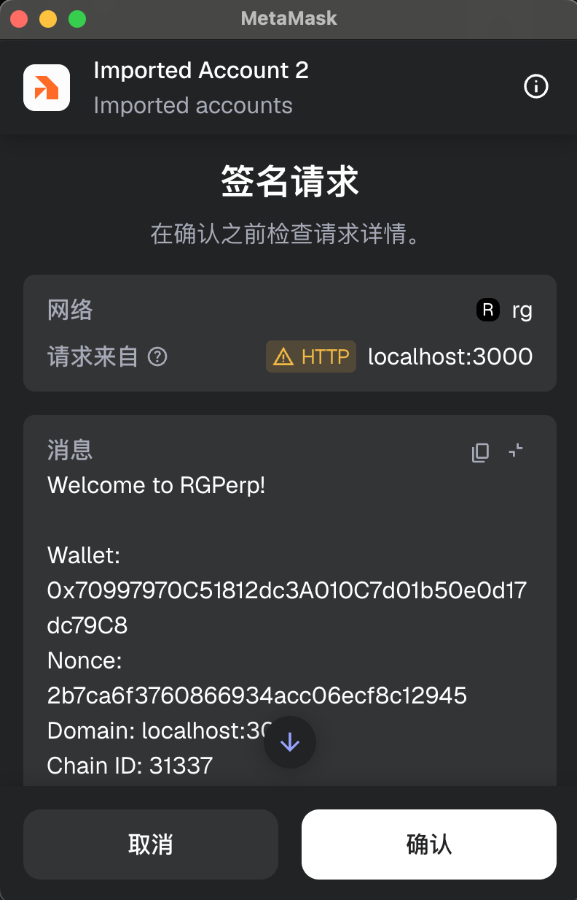

<!-- 图8：登录成功进入交易页 -->
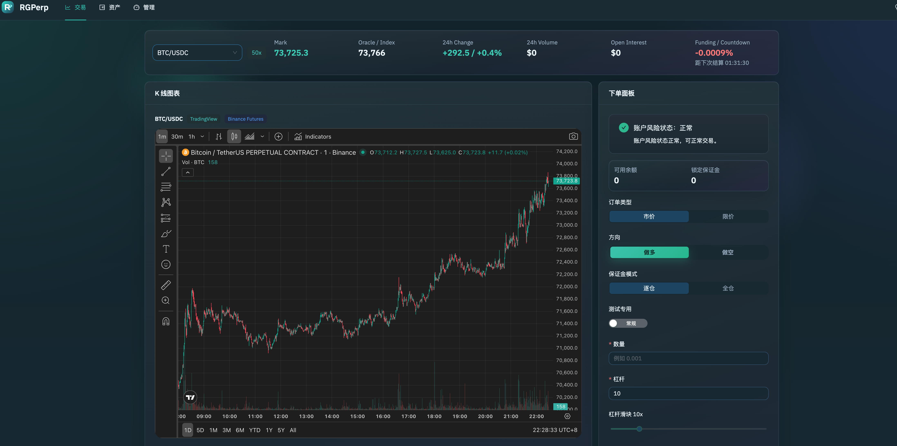

---

## 五、步骤三：链上充值

### 操作

1. 进入 **Account** 或 **资产** 页面
2. 点击 **Deposit** / **充值**
3. 在 MetaMask 中完成 USDC 授权（如尚未授权）
4. 调用 Vault 合约 `deposit(amount)` 发起充值
5. 等待链上确认
6. Indexer 监听到 Deposit 事件后，更新链下账户 `available_balance`

### 技术说明

- 用户需先对 Vault 进行 USDC `approve`
- 充值调用 `Vault.deposit(amount)`，合约发出 `Deposit(user, amount)` 事件
- Indexer 消费事件，幂等写入 `vault_events`，并贷记用户 `accounts.available_balance`

### 预期

- 链上交易成功
- 几秒内账户余额刷新，`available_balance` 增加对应金额

<!-- 图9：充值入口与金额输入 -->
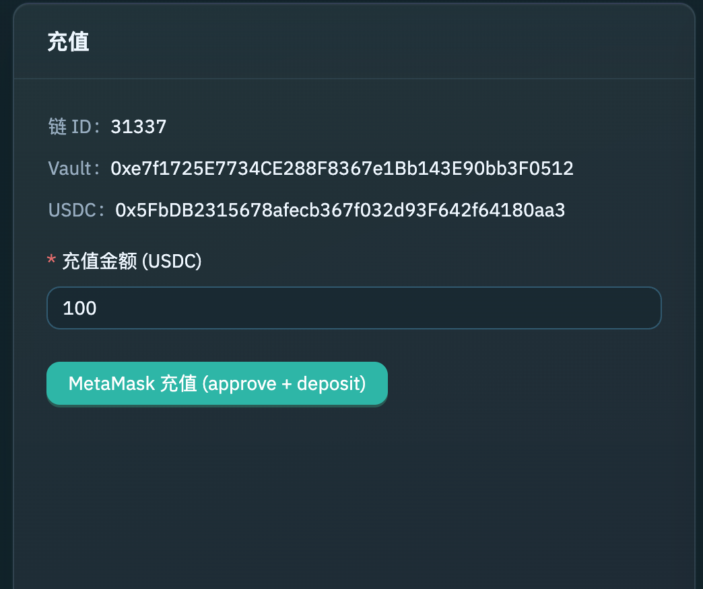

<!-- 图10：MetaMask 确认充值交易 -->
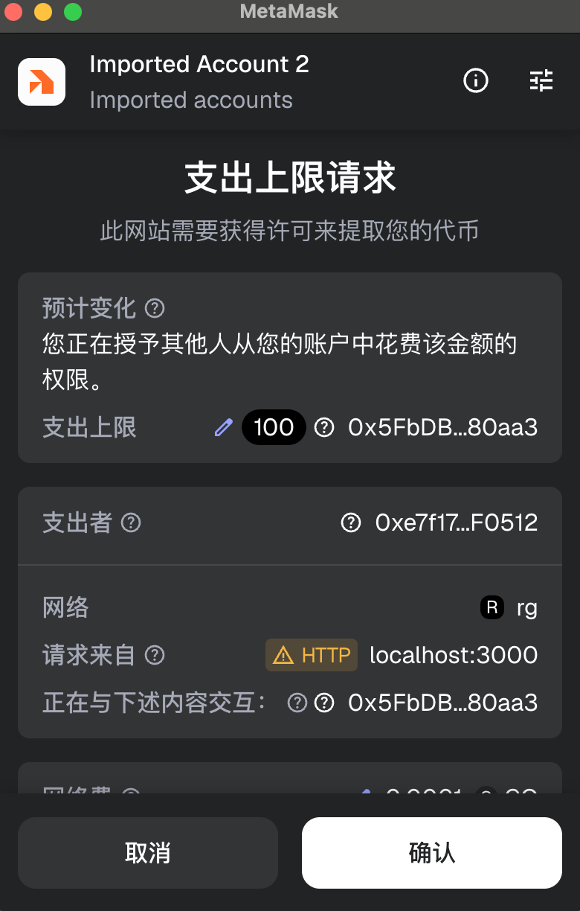

<!-- 图11：充值后余额更新 -->
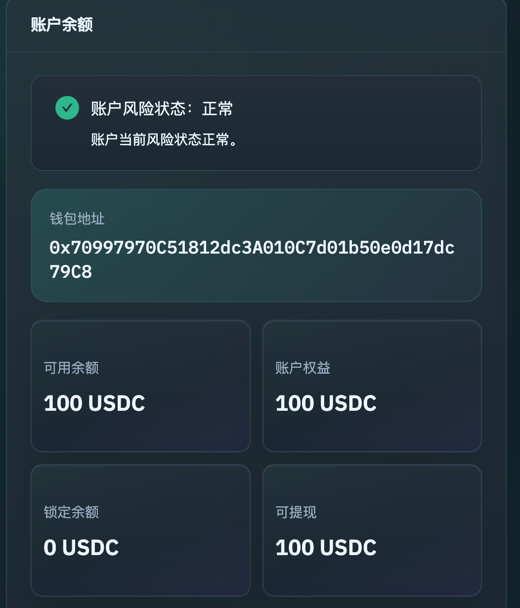

---

## 六、步骤四：开仓

### 操作

1. 在交易页选择交易对（如 BTC-PERP）
2. 选择方向：Long / Short
3. 设置杠杆倍数（如 10x）
4. 输入开仓数量（size）
5. 选择保证金模式：全仓 / 逐仓
6. 点击 **Place Order** / **下单**

### 技术说明

- 市价单与 CFD 模式：用户与平台资金池即时成交
- 交易引擎：获取 mark price → 风控校验 → 扣减保证金 → 更新仓位 → 写 trade/ledger → 发布 hedge task
- 风控校验：余额、杠杆、限仓、价格有效性等

### 预期

- 订单成功返回
- 仓位列表出现新仓位
- 可用余额减少（锁定初始保证金）
- 若配置对冲，Hedger 异步处理 hedge task

<!-- 图12：下单面板与参数设置 -->
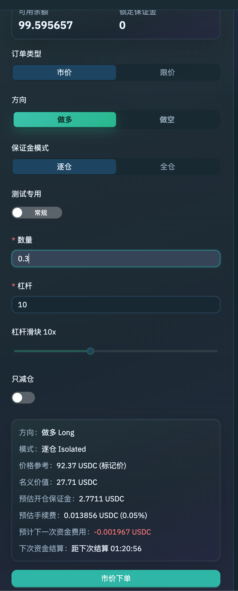

<!-- 图13：下单成功与仓位展示 -->


<!-- 图14：账户余额与锁定保证金变化 -->
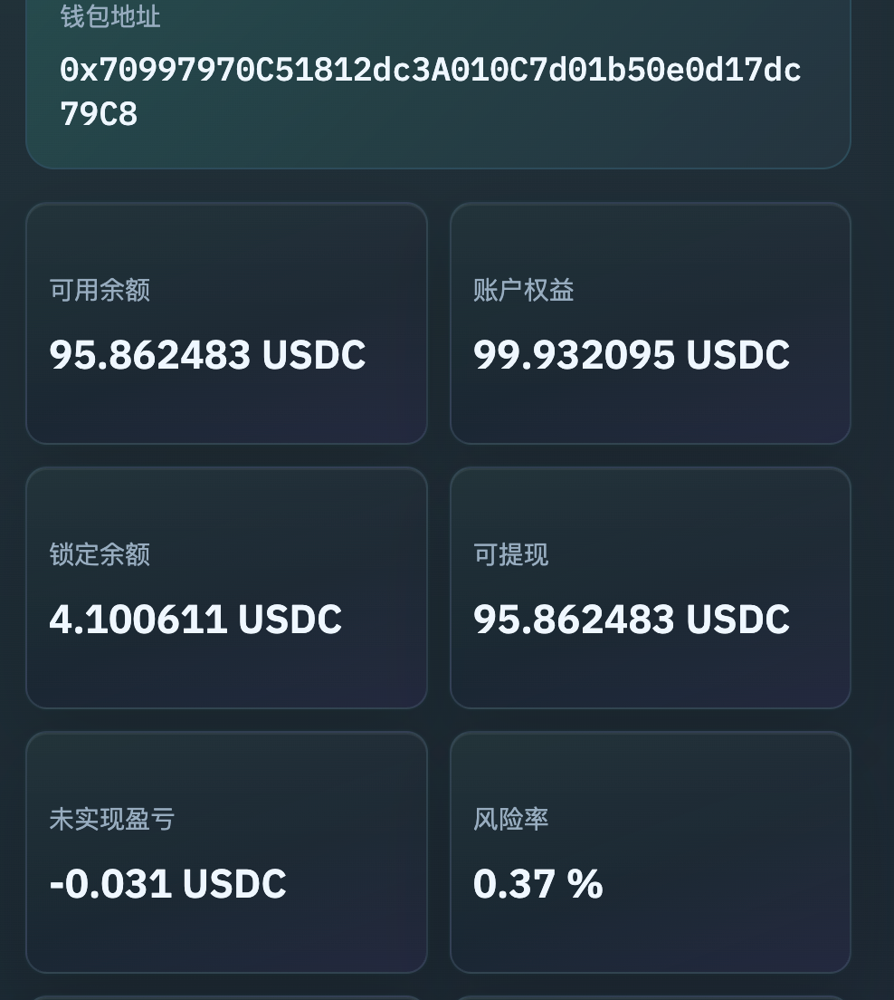

<!-- 图15：对冲 -->
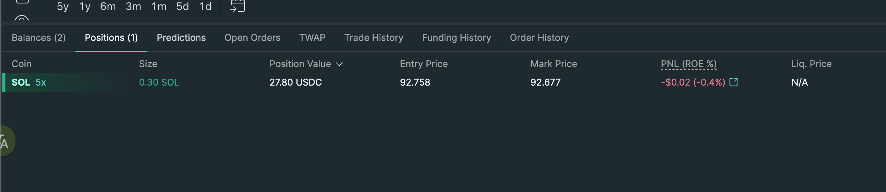

---

## 七、步骤五：持仓与风控

### 操作

1. 在 **Positions** / **仓位** 页面查看当前持仓
2. 查看未实现盈亏（Unrealized PnL）
3. 查看清算价格（Liquidation Price）
4. 查看风险率（Margin Ratio）与风险等级（Risk Level）

### 技术说明

- `equity = available_balance + locked_balance + unrealized_pnl`
- `maintenance_margin = |position_size| * mark_price * maintenance_margin_rate`
- `margin_ratio = equity / maintenance_margin`
- 风险等级：NORMAL → AT_RISK → REDUCE_ONLY → LIQUIDATING → FROZEN

### 预期

- 仓位展示 entry price、mark price、size、leverage、PnL
- 清算价格与风险率正确计算
- 风险等级随市场变化更新

<!-- 图16：仓位列表与 PnL -->
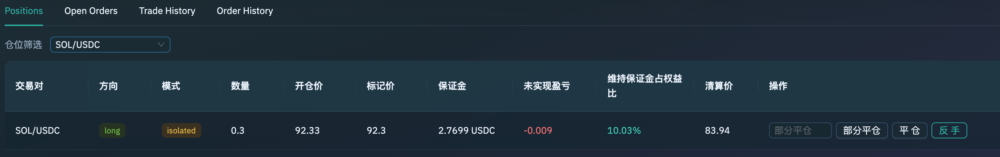

---

## 八、步骤六：平仓

### 操作

1. 在仓位行点击 **Close** / **平仓** 或 **Reduce** / **减仓**
2. 输入平仓数量（或选择全部平仓）
3. 确认后提交
4. 交易引擎执行：计算已实现 PnL → 释放保证金 → 更新仓位 → 写 trade/ledger → 触发 hedge rebalance

### 预期

- 平仓成功
- 已实现 PnL 计入 `available_balance`
- 仓位减少或关闭
- 若全平，仓位从列表移除

<!-- 图17：平仓入口与数量输入 -->


<!-- 图18：平仓后仓位与余额变化 -->
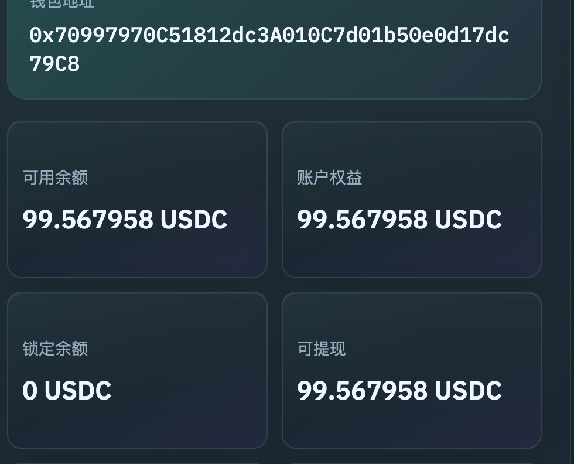

---

## 九、步骤七：提现

### 操作

1. 进入 **Account** 页面
2. 点击 **Withdraw** / **提现**
3. 输入提现金额
4. 后端校验：可用余额、风控状态、限额
5. 后端生成 EIP-191 签名（nonce、deadline、amount）
6. 前端调用 `Vault.withdraw(user, amount, nonce, deadline, signature)`
7. Indexer 监听到 Withdraw 事件，借记链下账户

### 技术说明

- 提现需后端 operator 签名授权
- 合约校验签名与 nonce 后执行转账
- 链上 Withdraw 事件驱动 Indexer 更新账本

### 预期

- 提现请求成功
- 链上交易确认后，链下余额减少
- 钱包 USDC 余额增加

<!-- 图19：提现入口与金额输入 -->
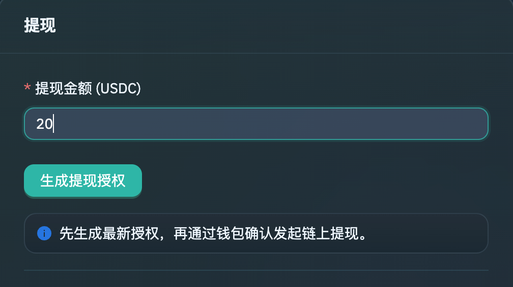

<!-- 图23：提现授权 -->
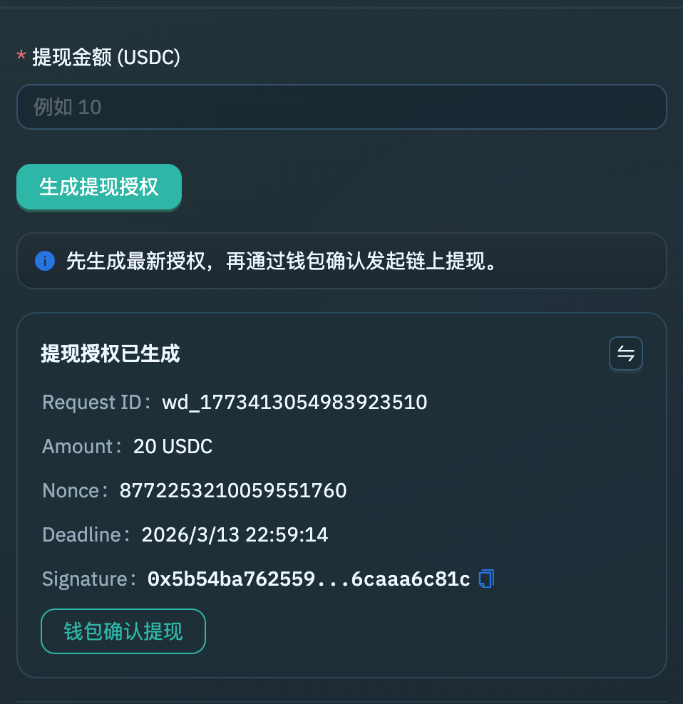

<!-- 图20：提现签名与链上确认 -->
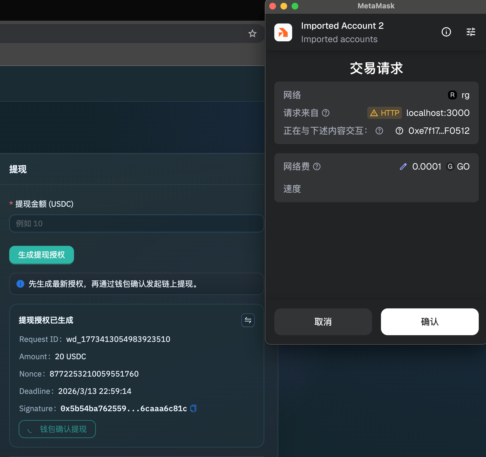

<!-- 图21：提现成功后余额变化 -->
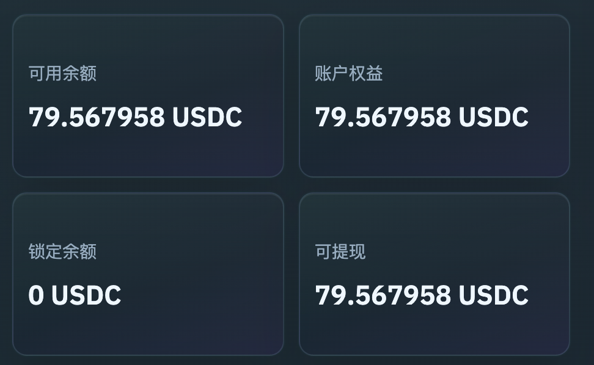

---

## 十 清算流程演示

当 `equity ≤ maintenance_margin` 时，Liquidator 自动触发强平。

### 前置条件

- 用户已开仓且仓位有足够名义价值
- 将 mark price 手动插入到足够低（多仓）或足够高（空仓）以触发清算

### 操作概要

1. 用户开多仓（如 BTC-PERP long 0.011 @ 10x）
2. 通过数据库或 mock 价格源插入低 mark price
3. Liquidator 扫描到风险账户，执行部分或全量强平
4. 清算记录写入 `liquidations` 表
5. 保险基金吸收坏账（若有）

### 预期

- 仓位被强制平掉
- 清算记录可查
- 账户状态恢复或进入下一档处理


<!-- 图22：清算前风险状态 -->
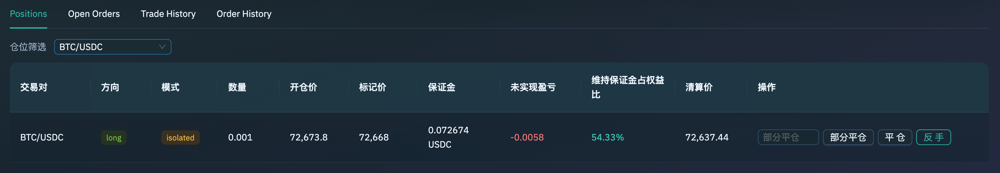

<!-- 图23：清算执行与清算记录 -->
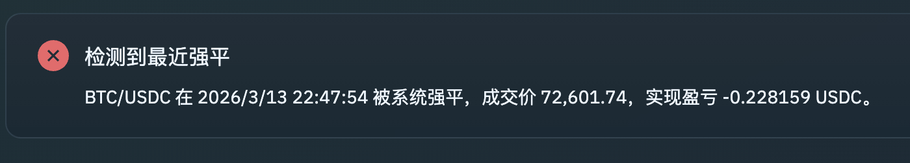

<!-- 图23：清算执行与清算记录 -->
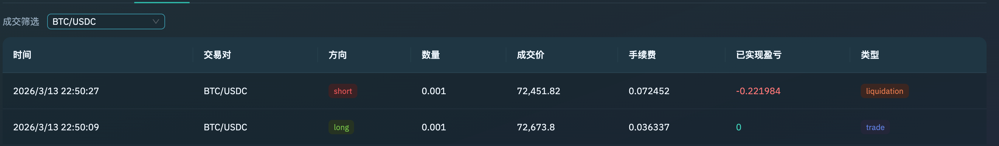

<!-- 图23：清算执行与清算记录 -->
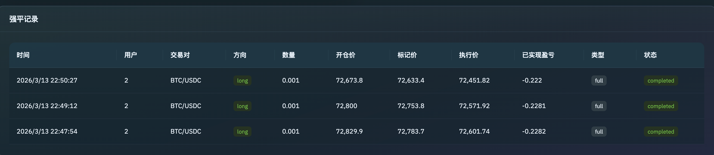

---

## 十一、附录：演示账户

重置脚本会预置以下账户（以 `.local/demo_accounts.md` 为准）：

| 角色 | 地址 | 说明 |
|------|------|------|
| Admin | `0x70997970C51812dc3A010C7d01b50e0d17dc79C8` | 管理员，预充 100 ETH + 10000 USDC |
| 普通用户 | `0x27B0646f5813974B145e8452d2a2995D136A8622` | 演示用户，预充 100 ETH + 10000 USDC |

合约地址由 `reset_demo_env.sh` 输出，并写入 `backend/.env` 与 `frontend/.env.local`。

---

## 十二、图片目录说明

截图请按以下路径存放，便于文档引用：

```
docs/
  demo_images/
    step-00-reset-script.png      # 重置脚本执行
    step-00-docker-health.png     # Docker 与健康检查
    step-00-frontend-start.png    # 前端启动
    step-01-landing.png           # Landing 首页
    step-01-launch-app.png        # Launch App 跳转
    step-02-connect-wallet.png    # 连接钱包
    step-02-sign-challenge.png    # 签名挑战
    step-02-logged-in.png         # 登录成功
    step-03-deposit-modal.png     # 充值弹窗
    step-03-metamask-deposit.png  # MetaMask 充值确认
    step-03-balance-updated.png   # 余额更新
    step-04-order-panel.png       # 下单面板
    step-04-position-created.png  # 仓位创建
    step-04-balance-locked.png    # 保证金锁定
    step-05-positions.png         # 仓位列表
    step-05-risk-metrics.png     # 风险指标
    step-06-close-modal.png      # 平仓弹窗
    step-06-after-close.png      # 平仓后状态
    step-07-withdraw-modal.png   # 提现弹窗
    step-07-withdraw-confirm.png # 提现确认
    step-07-withdraw-success.png# 提现成功
    step-08-pre-liquidation.png  # 清算前（可选）
    step-08-liquidation-record.png # 清算记录（可选）
```

---

*文档版本：基于 Architecture.md、TECH_ARCHITECTURE.md、LIQUIDATION_TEST_RUNBOOK.md 整理*
