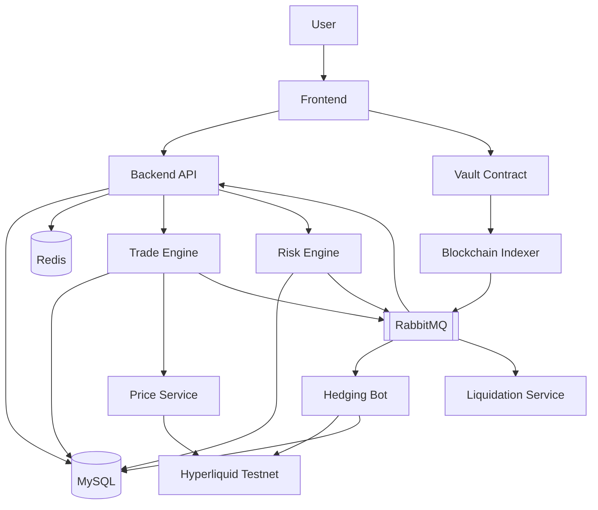

# RGPerp

链上托管、链下交易、外部对冲的永续合约交易系统。

系统覆盖完整交易闭环：钱包登录 → 充值 → 开仓 / 加仓 / 减仓 / 平仓 → 风控 / 清算 → Hyperliquid 对冲 → 提现。

## 技术栈

| 层级 | 选型 |
| --- | --- |
| 前端 | React + Vite + TypeScript + Ant Design |
| 图表 | TradingView Lightweight Charts |
| Web3 | wagmi + viem |
| 状态管理 | zustand + TanStack Query |
| 后端 | Go + Gin + GORM |
| 数据库 | MySQL 8.0 |
| 缓存 | Redis |
| 消息队列 | RabbitMQ |
| 合约 | Solidity + Foundry |
| 容器 | Docker Compose |

## 快速启动

### 1. 启动基础设施

```bash
docker compose up -d mysql redis rabbitmq
```

### 2. 启动本地链

推荐使用 `Anvil` 作为本地开发链：

```bash
anvil
```

说明：

- Vault、MockUSDC、Indexer、提现签名联调都需要本地 EVM 链
- Hyperliquid Testnet 仅用于价格联调与对冲，不替代本地 Vault 开发链

### 3. 配置环境变量

复制并填写 `backend/.env`、`frontend/.env.local`、`contracts/.env`。

可参考：

- `backend/.env.example`
- `frontend/.env.example`
- `contracts/.env.example`

### 4. 部署合约

```bash
cd contracts && forge script script/Deploy.s.sol --broadcast --rpc-url http://127.0.0.1:8545
```

### 5. 启动后端

```bash
cd backend && go run cmd/server/main.go
```

### 6. 启动链下服务

```bash
go run cmd/indexer/main.go
go run cmd/hedger/main.go
go run cmd/liquidator/main.go
```

### 7. 启动前端

```bash
cd frontend && pnpm install && pnpm dev
```

## 系统架构



系统采用链上托管 + 链下交易 + 外部对冲的三层架构。Vault 合约负责资金托管；交易引擎、风控、清算在链下执行；净敞口通过 Hyperliquid 对冲。

## 关键设计决策

**交易模型** — 采用 CFD 模式。用户订单与平台资金池即时成交，平台净风险敞口通过 Hyperliquid 转移。数据模型按多 symbol 设计，首发 BTC-PERP。

**价格源** — 主行情源为 Hyperliquid `allMids / candleSnapshot`，与对冲执行环境一致。系统支持 mock 模式和第三方 API 作为兜底源。Price Service 输出 `index_price`、`mark_price`、`execution_price` 三层价格。

**对冲策略** — 按交易所净敞口统一对冲，而非逐笔用户订单对冲。Hedger 以 symbol 为粒度计算目标净头寸，将外部仓位调整至目标值。支持对冲阈值、批量净额、熔断与自动 reduce-only 降级。

**提现模型** — 后端签名授权提现。用户发起提现请求后，后端校验可用余额、仓位风险和风控状态，生成签名后由用户调用合约执行。

**清算机制** — 独立 Liquidation Service 持续扫描风险账户。当 equity 低于维持保证金时触发，支持部分清算与全量强平两级策略，清算后自动同步对冲仓位。

**风控体系** — 覆盖交易前（保证金、杠杆、限仓、价格有效性）、持仓中（风险率、维持保证金、对冲偏差）、提现前（余额、冻结状态、限额）三个维度。

## 已知约束

- 首发标的为 BTC-PERP，架构与 schema 支持多 symbol 扩展
- 当前订单类型为 Market Order，限价单与条件单作为后续迭代
- Hyperliquid 外部依赖具备重试和降级策略，但极端情况下仍存在短时对冲延迟
- 保险基金、自动减仓（ADL）、资金费率（Funding Rate）属后续迭代范围

## 文档索引

| 文档 | 内容 |
| --- | --- |
| `ARCHITECTURE.md` | 系统架构、模块划分、数据流、风控与清算设计 |
| `spec/TECH_ARCHITECTURE.md` | 技术栈、目录结构、基础设施、消息队列、安全设计 |
| `spec/DATABASE_SCHEMA.md` | 完整 GORM 表结构与索引策略 |
| `spec/API_SPEC.md` | RESTful API 接口规范与 WebSocket 协议 |
| `AI_REPORT.md` | AI 工具使用报告 |
