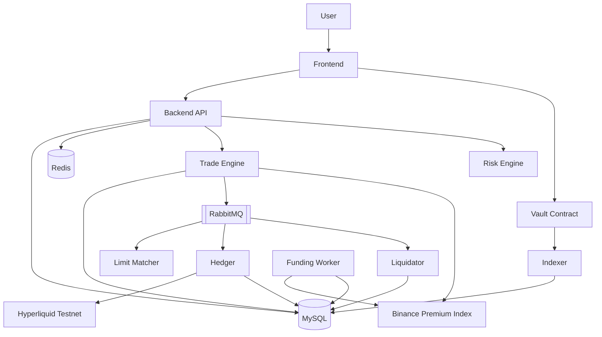

# RGPerp

RGPerp 是一套链上资金托管、链下交易执行、外部净敞口对冲的永续合约交易系统。系统包含前端交易终端、后端 API、链下交易与风控服务、Vault 合约、链上事件索引器、对冲机器人、清算服务和管理面板。

## 技术栈

| 层级 | 选型 |
| --- | --- |
| 前端 | React + Vite + TypeScript + Ant Design |
| 图表 | TradingView Advanced Chart |
| Web3 | wagmi + viem |
| 后端 | Go + Gin + GORM |
| 数据库 | MySQL 8.0 |
| 缓存 | Redis |
| 队列 | RabbitMQ |
| 合约 | Solidity + Foundry |
| 容器 | Docker Compose |
| 外部对冲 | Hyperliquid Testnet |
| 价格源 | Binance USDⓈ-M premium index |

## 快速启动

### 1. 准备环境变量

复制并填写以下文件：

- [backend/.env.example](/Users/xiaobao/PerpExchange/backend/.env.example)
- [frontend/.env.example](/Users/xiaobao/PerpExchange/frontend/.env.example)
- [contracts/.env.example](/Users/xiaobao/PerpExchange/contracts/.env.example)

### 2. 启动本地链

```bash
anvil
```

本地链用于部署 `Vault` 与 `MockUSDC`，完成充值、提现和索引联调。

### 3. 部署合约

```bash
cd contracts
forge script script/Deploy.s.sol --broadcast --rpc-url http://127.0.0.1:8545
```

### 4. 一键启动后端服务

```bash
docker compose up -d mysql redis rabbitmq server indexer hedger liquidator matcher fundingd
```

常用命令：

```bash
docker compose ps
docker compose logs -f server indexer hedger liquidator matcher fundingd
docker compose down
```

服务说明：

- `server`：`http://127.0.0.1:18080`
- `indexer`：同步 Vault 充值/提现事件
- `hedger`：执行净敞口对冲任务
- `liquidator`：扫描风险仓位并执行强平
- `matcher`：触发限价单成交
- `fundingd`：执行资金费率结算

### 5. 启动前端

```bash
cd frontend
pnpm install
pnpm dev
```

默认地址：

- Landing / App：`http://localhost:3000`

## 系统架构



## 当前能力

- 钱包签名登录与 JWT 会话
- Vault 合约充值、提现与链上事件索引
- 多交易对交易：`BTC/USDC`、`ETH/USDC`、`SOL/USDC`
- 市价单与限价单
- 多空双向持仓；同向加仓、反向独立分仓
- 全仓 / 逐仓保证金模式
- 已实现盈亏、未实现盈亏、清算价、风险率
- 资金费率结算与资金费率历史
- 净敞口对冲、失败重试、管理台手动重试
- 自动清算、强平记录与反向对冲
- Admin 管理页：风险快照、对冲任务、清算记录、系统告警

## 关键设计决策

### 交易模型

系统采用 CFD 模式。用户订单在平台内部成交，平台根据内部净敞口统一生成对冲任务，并在 Hyperliquid Testnet 执行外部对冲。

### 价格模型

风控、PnL、资金费率和倒计时统一使用 Binance USDⓈ-M `premiumIndex` 数据；图表使用 TradingView 的 Binance 永续市场数据。

### 对冲模型

对冲任务以系统内部净敞口为唯一目标。任务执行不读取外部人工仓位作为本次下单基准；风险快照保留外部真实仓位，仅用于监控偏差。

### 资金模型

账户展示区分交易权益与兑付口径：

- 交易权益：`available_balance`、`locked_balance`、`equity`
- 兑付口径：`net_deposits`、`settled_pnl_balance`、`unsettled_pnl_balance`、`payout_capacity`

用户盈利先进入账务权益，只有具备真实兑付能力的部分才进入可提现额度。

### 提现模型

提现采用后端签名授权模式。后端完成余额、风控、兑付能力和提现限额检查后，签发链上提现授权，由用户自行发送链上交易。

## 已知限制

- 外部对冲账户需保持为系统专用账户；人工在 Hyperliquid 上手工下单会引入外部残仓偏差
- 限价单当前为条件触发成交模型，不是订单簿撮合模型
- 盘口深度为系统展示层报价，不参与真实成交
- 前端 `管理` 页面仅对管理员白名单钱包开放

## 文档索引

| 文档 | 内容 |
| --- | --- |
| [Architecture.md](/Users/xiaobao/PerpExchange/Architecture.md) | 系统架构、模块划分、数据流、风控与清算设计 |
| [spec/TECH_ARCHITECTURE.md](/Users/xiaobao/PerpExchange/spec/TECH_ARCHITECTURE.md) | 技术栈、目录结构、基础设施与安全设计 |
| [spec/DATABASE_SCHEMA.md](/Users/xiaobao/PerpExchange/spec/DATABASE_SCHEMA.md) | GORM 表结构与索引设计 |
| [spec/API_SPEC.md](/Users/xiaobao/PerpExchange/spec/API_SPEC.md) | REST API 契约 |
| [AI_REPORT.md](/Users/xiaobao/PerpExchange/AI_REPORT.md) | AI 使用报告 |
| [DEMO.md](/Users/xiaobao/PerpExchange/DEMO.md) | 演示文档 |
