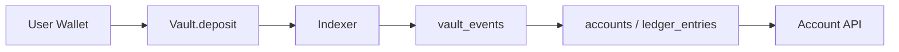
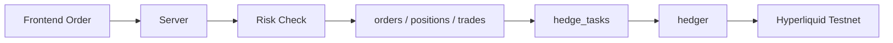
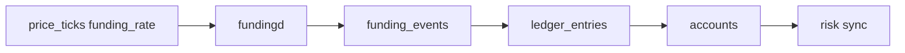

# 技术架构规范

本文档描述当前代码库已经实现的技术架构与运行方式，作为对外技术说明与内部开发对齐基线。

## 1. 技术栈

| 层级 | 选型 | 当前用途 |
| --- | --- | --- |
| 前端 | React + Vite + TypeScript | 纯客户端 SPA |
| UI | Ant Design | 数据密集型交易界面、表单、表格、反馈组件 |
| 图表 | TradingView Embed | K 线、指标与专业图表交互 |
| 状态与请求 | TanStack Query + 本地状态 | API 拉取、轮询、界面状态管理 |
| 后端 API | Go + Gin | HTTP API、鉴权、账户、订单、Admin |
| ORM | GORM | MySQL 访问与迁移 |
| 数据库 | MySQL 8.0 | 主业务数据存储 |
| 缓存 | Redis | 健康检查与扩展预留 |
| 消息队列 | RabbitMQ | 基础依赖已接入，本阶段未作为核心业务主线 |
| 合约 | Solidity + Foundry | Vault 与 MockUSDC |
| 链交互 | go-ethereum | 本地链事件监听、签名与地址配置 |
| 对冲桥接 | Go + Python bridge | 通过 Hyperliquid SDK 执行真实测试网对冲 |
| 编排 | Docker Compose | 本地一键启动后端多进程 |

## 2. 系统分层

当前系统采用“链上资金托管 + 链下交易与风控 + 外部真实对冲”的架构。

### 2.1 链上层

- `Vault.sol`
  - 负责托管 USDC 资金
  - 接受充值
  - 校验 operator 签名后执行提现
- `MockUSDC.sol`
  - 本地联调用测试稳定币

### 2.2 链下交易层

- `server`
  - 账户、市场、订单、提现、Admin API
- `matcher`
  - 限价单触发与成交执行
- `hedger`
  - 内部净敞口对冲至 Hyperliquid Testnet
- `liquidator`
  - 风险扫描与强平执行
- `fundingd`
  - 资金费率周期结算
- `indexer`
  - 监听 Vault 链上事件并入账

### 2.3 外部市场层

- Hyperliquid Testnet
  - 真实外部对冲 venue
- Binance / TradingView
  - 外部价格、图表与 funding 参考输入

## 3. 当前代码结构

### 3.1 前端

当前前端主要目录：

```text
frontend/src/
├── components/
│   ├── brand/
│   ├── landing/
│   ├── layout/
│   └── trading/
├── pages/
│   ├── LandingPage.tsx
│   ├── TradePage.tsx
│   ├── AccountPage.tsx
│   ├── AdminPage.tsx
│   └── DocsPage.tsx
├── services/
├── types/
├── utils/
├── App.tsx
└── styles.css
```

说明：

- 前端当前不依赖 WebSocket 主链路
- 主要通过轮询 API 驱动交易、账户和 Admin 页面
- 用户可见交易对统一显示为 `BTC/USDC`、`ETH/USDC`、`SOL/USDC`

### 3.2 后端

当前后端目录：

```text
backend/
├── cmd/
│   ├── server/
│   ├── indexer/
│   ├── hedger/
│   ├── liquidator/
│   ├── matcher/
│   └── fundingd/
├── internal/
│   ├── config/
│   ├── handler/
│   ├── hedge/
│   ├── indexer/
│   ├── middleware/
│   ├── model/
│   ├── pkg/
│   ├── router/
│   └── service/
└── scripts/
    └── hyperliquid_bridge.py
```

说明：

- 风控、订单、清算、资金费率等核心业务逻辑集中在 `internal/service`
- Hyperliquid 真实执行由 Go `hedger` 调用 Python bridge 完成

## 4. 当前已实现模块

### 4.1 账户与资金

- 钱包签名登录
- 充值信息查询
- 链上充值事件入账
- 提现签名授权与链上提现确认
- 账户权益、可提现余额、净入金、已结算/待结算盈利展示

### 4.2 交易与仓位

- 市价单
- 限价单（GTC，条件触发模型）
- 同方向仓位合并
- 反方向仓位分仓，不自动净仓
- `isolated / cross`
- 部分平仓、平仓、反手

### 4.3 风控

- 初始保证金、维持保证金
- 未实现盈亏、已实现盈亏
- 账户风险状态推进
- isolated 单仓清算
- cross 账户口径风险管理
- 提现前风控校验

### 4.4 对冲

- 内部净敞口生成 hedge task
- Hyperliquid Testnet 真实执行
- 自动重试
- Admin 手动重试
- 风险快照与对冲任务监控

### 4.5 资金费率

- 基于外部 funding_rate / funding_next_at 的周期结算
- 结算后写 `funding_events`
- 同步账本与风险状态

### 4.6 Admin

- 系统概览
- 对冲任务列表
- 风险快照列表
- 强平记录列表
- 风险告警列表
- 管理员白名单访问控制

## 5. 交易模型

当前交易模型不是订单簿撮合，而是 CFD 模式：

1. 用户在平台内部开仓、平仓
2. 平台记录仓位、保证金、PnL 和风险状态
3. 系统基于内部净敞口创建 hedge task
4. `hedger` 将净风险搬到 Hyperliquid Testnet

这意味着：

- 用户成交不依赖另一个用户挂单
- 外部对冲用于平台风险中性，而不是用户撮合对手盘
- 限价单本质上是“价格条件触发后执行真实成交”，不是订单簿挂单撮合

## 6. 对冲语义

当前对冲逻辑采用以下口径：

- 对冲目标只由**系统内部净敞口**决定
- 外部真实仓位只用于风险快照和监控，不参与新任务目标计算
- 自动 `reconcile` 已关闭，偏差仅做监控与人工处理

任务执行策略：

- 创建 task 时记录：
  - `internal_net_position`
  - `target_hedge_position`
  - `current_hedge_position`
  - `drift`
- 执行失败后自动最多重试 3 次
- 达到上限后由 admin 手动重试

## 7. 资金模型

当前资金模型分为两层：

### 7.1 交易权益层

- `available_balance`
- `locked_balance`
- `equity`
- `unrealized_pnl`

用于：

- 下单
- 保证金
- 清算
- 风险状态判断

### 7.2 兑付层

- `net_deposits`
- `settled_pnl_balance`
- `unsettled_pnl_balance`
- `settlement_pool`
- `payout_capacity`

用于：

- 判断盈利是否具备真实兑付来源
- 限制用户盈利提现

结论：

- 用户权益可即时反映盈利
- 但盈利只有在进入结算池后，才可提现

## 8. 进程与启动方式

当前 Docker Compose 已统一后端多进程：

- `mysql`
- `redis`
- `rabbitmq`
- `server`
- `indexer`
- `hedger`
- `liquidator`
- `matcher`
- `fundingd`

默认对外提供：

- `server`: `127.0.0.1:18080`
- `mysql`: `127.0.0.1:3306`
- `redis`: `127.0.0.1:6379`
- `rabbitmq`: `127.0.0.1:5672`

## 9. 关键数据流

### 9.1 充值



### 9.2 下单



### 9.3 强平


### 9.4 资金费率



## 10. 当前边界

以下能力当前未实现或仅为第一阶段实现：

- 完整订单簿撮合
- 用户间 maker/taker 撮合深度
- WebSocket 主驱动实时推送
- 平台外部资金费率收益回流建模
- 自动 reconcile 外部脏仓修复
- 生产级告警、审计与高可用部署

当前技术架构面向：

- 本地完整联调
- 演示级完整流程
- 永续交易核心链路验证

而不是生产环境多地域高可用部署。
